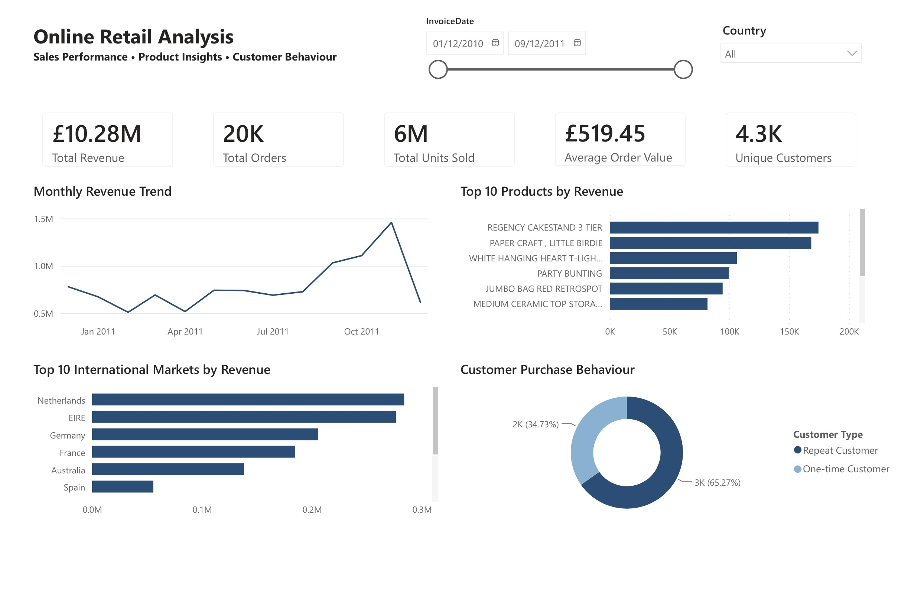

# Online Retail Sales Analysis

An end-to-end data analytics project using **MySQL and Power BI** to clean, analyse and visualise online retail transaction data. The project explores overall sales performance, product performance, international markets and customer purchasing behaviour.

## Dashboard

## Project Overview

The objective of this project was to transform raw transactional retail data into meaningful business insights.

The analysis focused on answering four key questions:

- How is revenue performing over time?
- Which products contribute the most revenue?
- Which international markets generate the most revenue outside the UK?
- What proportion of identifiable customers make repeat purchases?

## Dataset

The dataset contains transactional records from a UK-based online retailer covering **December 2010 to December 2011**.

The raw dataset contained **541,909 rows** and included:

- Invoice number
- Product/stock code
- Product description
- Quantity
- Invoice date
- Unit price
- Customer ID
- Country

After cleaning, **527,947 rows** remained for analysis.

## Data Cleaning

Data cleaning was performed in **MySQL** before the cleaned dataset was imported into Power BI.

Key steps included:

- Identified missing values across key fields.
- Investigated negative quantities and cancelled invoices.
- Removed transactions with non-positive quantities or prices.
- Removed cancelled invoices.
- Removed rows without valid product descriptions.
- Excluded administrative/non-product stock codes.
- Trimmed text fields for consistency.
- Created `TotalSales` as `Quantity × UnitPrice`.
- Retained transactions with missing Customer IDs for overall sales analysis while excluding them from customer-level analysis.

## SQL Analysis

SQL was used to investigate:

- Overall revenue, orders and units sold
- Monthly revenue performance
- Average order value
- Product performance by revenue and units sold
- Product revenue contribution
- Country and international market performance
- Customer purchasing behaviour
- Repeat purchase rate
- Top customers by revenue

The cleaned SQL analysis is available in [`retail_analysis.sql`](retail_analysis.sql).

## Power BI Dashboard

After completing the SQL cleaning and analysis, the cleaned dataset was imported into **Power BI** to build an interactive sales dashboard.

Power BI development included:

- Created DAX measures for Total Revenue, Total Orders, Total Units Sold, Average Order Value and Unique Customers.
- Created a `Month Start` field to analyse revenue chronologically.
- Built dynamic measures to classify identifiable customers as one-time or repeat customers.
- Calculated customer purchase behaviour within the active filter context.
- Created an international country ranking measure to identify the top 10 markets while excluding the UK.
- Added interactive Date and Country slicers.
- Designed KPI cards and visualisations for monthly revenue, product performance, international markets and customer purchasing behaviour.

### Key KPIs

| KPI | Result |
|---|---:|
| Total Revenue | £10.28M |
| Total Orders | 19,789 |
| Total Units Sold | 5.58M |
| Average Order Value | £519.45 |
| Unique Identifiable Customers | 4,335 |
| Repeat Purchase Rate | 65.28% |

The complete interactive Power BI report is included in this repository:

**[`online_retail_sales_analysis.pbix`](online_retail_sales_analysis.pbix)**

## Key Insights

**Revenue peaked in November 2011.**  
The business generated approximately **£1.46M from 2,753 orders** during the month, making it the strongest revenue period in the dataset.

**Repeat purchasing was strong among identifiable customers.**  
Approximately **65.28%** of identifiable customers placed more than one order during the period, compared with **34.72%** who placed only one order.

**Revenue was distributed across the product catalogue.**  
The highest-revenue product contributed only approximately **1.75%** of total revenue, while the top 10 products together generated approximately **9.44%**.

**The UK was the dominant market.**  
International analysis was therefore separated from the UK to make differences between overseas markets easier to identify.

## Business Recommendations

- Investigate the factors behind the strong November performance and use them to inform planning for future peak periods.
- Continue developing repeat-purchase strategies while investigating opportunities to convert one-time customers into repeat buyers.
- Avoid over-reliance on a small number of products, as revenue is relatively dispersed across the product catalogue.
- Evaluate high-performing international markets individually to identify opportunities for targeted growth.

## Tools Used

- **MySQL** — data cleaning, validation and exploratory analysis
- **Power BI** — data modelling, DAX measures and interactive dashboard development
- **GitHub** — project documentation and portfolio presentation

## Project Files

- `retail_analysis.sql` — cleaned SQL analysis
- `online_retail_sales_analysis.pbix` — interactive Power BI dashboard
- `dashboard_screenshot.jpeg` — dashboard preview
